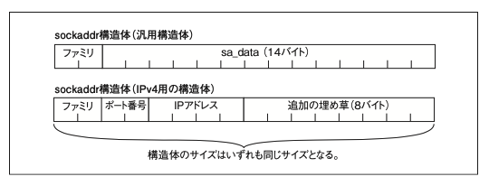

# ネットワーク
## OSI参照モデル
物理層
- データリンク層
生のビットストリームの送受信、エラー訂正やフロー制御
- ネットワーク層
下位層と上位層の間における情報 のやり取り(アドレッシン グ機能やルーティング機能)
- トランスポート層
信頼性とコストパフォーマン スの高いデータ伝送に責任
- セッション層
ネットワークアプリケーション間の接続の確立と維持に関する責任
- プレゼンテーション層
アプリケーションが理解できる構文や言語でデータを表現することに責任(暗号化やデータ圧縮)
- アプリケーション層
アプリケーションのニーズを取り扱う
-> 覚えてる？


## ソケット
TCPはストリームソケット
ソケットはC言語では /usr/include/sys/sockets.h に定義されている。
ソケットはインターネットプロトコルからAX.25のようなアマチュア無線のプロトコルまでいろんなプロトコルの通信に用いられる。
最も使われるのはストリームソケットとデータグラムソケット
[参考](https://ocserv.gitlab.io/ocserv/coverage/usr/include/bits/socket.h.gcov.html)

```
/* Types of sockets. */ enum __socket_type
{
    SOCK_STREAM = 1, /* Sequenced, reliable, connection-based byte streams. */ #define SOCK_STREAM SOCK_STREAM
    SOCK_DGRAM = 2, /* Connectionless, unreliable datagrams of fixed maximum length. */ #define SOCK_DGRAM SOCK_DGRAM
}
```

```
/* Get the definition of the macro to define the common sockaddr members. */
#include <bits/sockaddr.h>
/* Structure describing a generic socket address. */ struct sockaddr
{
    __SOCKADDR_COMMON (sa_); /* Common data: address family and length. */ 
    char sa_data[14]; /* Address data. */
};
```
SOCKADDR_COMMON という値によってアドレスファミリを定義、残りがアドレスデータ。
いで解釈では、アドレスファミリはアドレスの種類みたいなものでそれに合わせてアドレスの定義も変わっている。
しかし、それぞれのアドレス構造体が同じサイズなのでお互いにキャストできるようになっている。それによってsocket()関数はsockaddr構造体のポインタを受け取るだけで、IPv4,IPv6などの各種アドレス構造体を参照できる。


8バイト余っているが、キャスト時の互換性に使われる。

