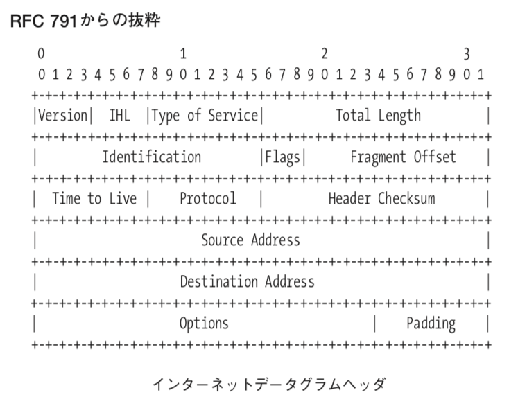
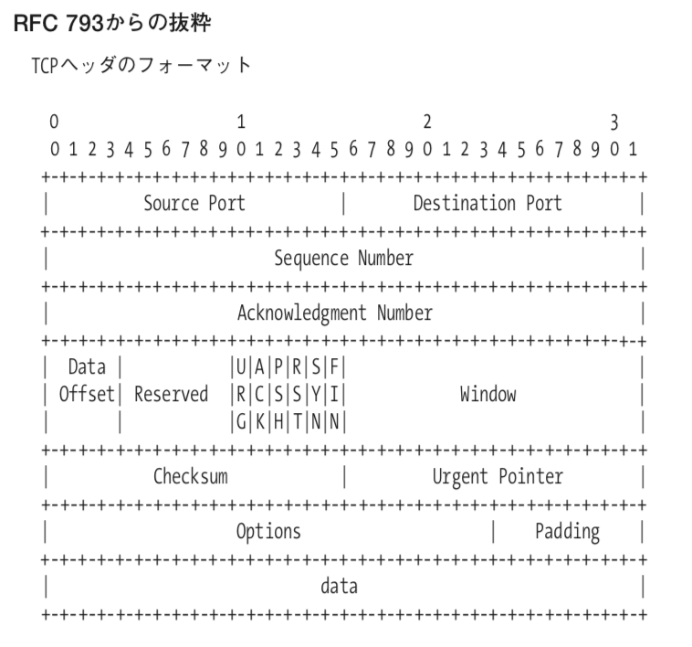

# スニッフィング

## tcpdump

```sh
tcpdump -l -X 'ip host 192.168.100.6'
```

## 生のソケット

この前のコードでは，ストリームソケットを用いた．この場合，TCP/IPに関する処理はOSに委託できた．
しかし生のソケットを扱う場合は，下位層を明示しなければならない．

raw_tcpsniff.c

```c
int main(void)
{
   int i, recv_length, sockfd;
   u_char buffer[9000];

   if ((sockfd = socket(PF_INET, SOCK_RAW, IPPROTO_TCP)) == -1)
      fatal("ソケットが生成できませんでした。");

   for (i = 0; i < 3; i++)
   {
      recv_length = recv(sockfd, buffer, 8000, 0);
      printf("%d バイトのパケットを取得しました。\n", recv_length);
      dump(buffer, recv_length);
   }
}
```

こういうコードを書く上で，マルチプラットフォームで書くのは非常に大変．

そこで，libpcapを使用すると，少し緩和される．

## pcap

```sh
$ sudo ./pcap_sniff

# スニッフィング対象： enp5s0
# 60 バイトのパケットを取得しました。
# ff ff ff ff ff ff 00 50 56 8f c8 cc 08 06 00 01 | .......PV.......
# 08 00 06 04 00 01 00 50 56 8f c8 cc cb b2 80 01 | .......PV.......
# 00 00 00 00 00 00 cb b2 80 e6 00 00 00 00 00 00 | ................
# 00 00 00 00 00 00 00 00 00 00 00 00             | ............
# 166 バイトのパケットを取得しました。
# 01 00 5e 00 01 81 00 1d c1 80 48 cc 08 00 45 e0 | ..^.......H...E.
# 00 98 92 9a 00 00 01 11 f7 b4 cb b2 80 f2 e0 00 | ................
# 01 81 c0 04 01 3f 00 84 37 4b 00 01 00 01 5f 44 | .....?..7K...._D
# 46 4c 54 00 00 00 00 00 00 00 00 00 00 00 01 01 | FLT.............
# 00 1d c1 80 48 cc 00 01 28 f7 00 00 00 0c 00 00 | ....H...(.......
# 00 00 00 12 08 78 20 c2 3f ec 00 00 00 00 00 01 | .....x .?.......
# 00 1d c1 80 48 cc 00 00 28 f7 00 00 00 99 44 46 | ....H...(.....DF
# 4c 54 00 00 f0 60 00 00 00 01 00 00 ff fe 00 00 | LT...`..........
# f0 60 00 00 00 00 00 00 00 99 44 46 4c 54 00 01 | .`........DFLT..
# 00 1d c1 80 48 cc 00 00 00 00 00 00 00 00 00 00 | ....H...........
# 00 00 00 00 00 00                               | ......
# 94 バイトのパケットを取得しました。
# 01 00 5e 00 01 81 00 1d c1 80 48 cc 08 00 45 b8 | ..^.......H...E.
# 00 50 92 9b 00 00 01 11 f8 23 cb b2 80 f2 e0 00 | .P.......#......
# 01 81 c0 05 01 40 00 3c 65 38 00 01 00 01 5f 44 | .....@.<e8...._D
# 46 4c 54 00 00 00 00 00 00 00 00 00 00 00 02 01 | FLT.............
# 00 1d c1 80 48 cc 00 01 28 f7 02 00 00 0c 00 00 | ....H...(.......
# 00 00 00 00 28 f7 00 12 08 78 20 c3 27 8b       | ....(....x .'.
```

階層を読み解いていく．



インターネットデータグラムヘッダ



tcp header
