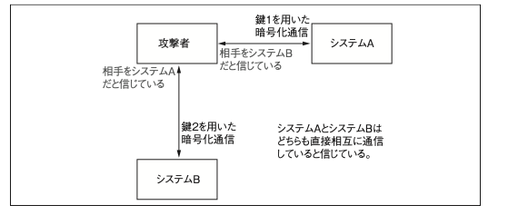

# 0x750 ハイブリッド暗号

対称暗号と非対称暗号を用いたもの。
復習だが、対称暗号は暗号化時と復号化時に同じ鍵を用いる暗号システム、非対称は異なる暗号システムのこと。

通信を行う際には対称暗号を使用し、その暗号化に使う鍵はランダムに生成されたものを非対称暗号によって交換する
対称暗号の処理速度と処理効率を維持しながら、鍵の配布という問題を解決。

## 0x751 MitM攻撃



ARPのリダイレクト&[mitm-ssh](https://github.com/jtesta/ssh-mitm) で実現できる。
これによってポート22に到来するTCP通信は、攻撃者が待ち構えているポート番号(root実行が必要ないものでいい)にリダイレクトされてしまう。

フィンガープリントが登録されており、クライアントソフトとしてopensshを使用している場合は接続できないエラーがでるが、初回接続の場合はフィンガープリント自体がMitMのものとなってしまう。そもそもWin用SSHクライアントはダイアログボックスがでるだけだったりするので、わからない人だとすぐにOKしてしまう。

## 0x752 SSHプロトコルによるホストのフィンガープリントの違い

新たなホストに対するSSHコネクションが初めて確立された場合、そのホストのフィンガープリントが `known_hosts` というファイルに追加される。
ただ、SSHにはSSH1とSSH2という別のプロトコルがあり、個別にホストのフィンガープリントを管理している。

ここまで説明すれば何をしたいかわかりそう？

攻撃者が設定ファイル( `/usr/local/etc/mitm-ssh_config` )にSSH1しか使えないような記述をした場合。
-> フィンガープリントはSSH2の方にしか登録されていないのであらたなフィンガープリントを登録するための警告しかでてこないため、スルーできてしまう。
-> 有名なので最近だと修正されている


## 0x753 ファジーフィンガープリント

[参考論文](http://ouah.lescigales.org/ffp.pdf)
フィンガープリントの見た目で判断されることがなくもない -> なら似せたフィンガープリント作ろう。

```通常
iz@tetsuo:~ $ ssh jose@192.168.42.72
The authenticity of host '192.168.42.72 (192.168.42.72)' can't be established. RSA key fingerprint is ba:06:7f:d2:b9:74:a8:0a:13:cb:a2:f7:e0:10:59:a0.
Are you sure you want to continue connecting (yes/no)?
```

```MtiM
iz@tetsuo:~ $ ssh jose@192.168.42.72
The authenticity of host '192.168.42.72 (192.168.42.72)' can't be established. RSA key fingerprint is ba:06:7e:b2:64:13:cf:0f:a4:69:17:d0:60:62:69:a0.
Are you sure you want to continue connecting (yes/no)?
```

これくらい似せることができる。

# 0x760 パスワードクラッキング

パスワードの格納時に、平文だと攻撃されてしまうので、よく用いられるのがcrypt()関数。
これは平文のパスワードとslat値を受け取ってハッシュ値を計算し、salt値を前置して出力する。

```マニュアルページより
salt値は[a-zA-Z0-9./]という文字集合から選択された2文字の文字列である。
この文字列はアルゴリズムに4096通りの変化を与えるために用いられる。
```

## 0x761 辞書攻撃

[crypt_crack.c](../src/chapter7/crypt_crack.c)

すべてのワードに対して特定のsalt値でハッシュ化し、その値とハッシュ値を比較する。
ただ、辞書にのっていないとできないし、処理時間大きいし、salt値も当てないといけない。

## 0x762 総当たり攻撃

使用可能な文字列の組み合わせをすべて試すもの。
8文字になると95^8種類のパスワード、すなわち6千兆を超える種類のパスワードを試す必要があるので現実的な時間で終わらなくなる。

## 0x763 ハッシュ検索テーブル

ハッシュ値のテーブルを作っておいて、そこから検索する方法。
O(l0gN)とかでできるものの、salt値毎にテーブル作っていたら容量大変なことになる。

## 0x764 パスワード確率マトリクス

計算量と記憶容量のトレードオフを考える。
crypt() 関数のアルゴリズムを用いたパ スワードハッシュでは、salt値はたったの4,096種類しか存在しないため、4,096倍しても現実的な記憶容量となるよう、
可能な限り容量を小さくすれば問題を緩和できるはず。

ここで突然難しい話になる。

[3次元バイナリマトリクス](./img/バイナリマトリクス.png)

[ppm_gen.c](../src/chapter7/ppm_gen.c)

上記を用いて出力される、142Mバイトの`4char.ppm`ファイルには、salt値が'je'となる考えられうる 4 文字のパスワードすべてに 対する平文とハッシュデータの緩やかな関係が保持されています。

[ppm_crack.c](../src/chapter7/ppm_crack.c)

このコードで`4char.ppm`を指定することで一瞬でパスワードをくらっくできる。

[RainbowCrack](https://project-rainbowcrack.com/)はさまざまなアルゴリズムをサポートしている。